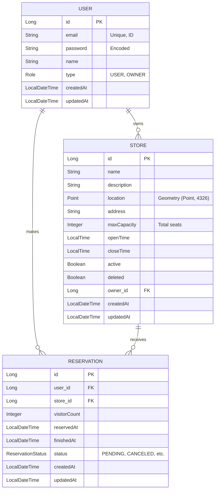

# Database Entity Relationship Diagram (ERD)

본 프로젝트의 데이터 모델은 사용자 권한 기반의 매장 관리 및 예약 시스템을 효율적으로 처리할 수 있도록 설계되었습니다.

## 핵심 설계 포인트
1. **공간 데이터(Geometry)**: Leaflet.js와 연동하여 위경도 좌표를 `Point` 타입으로 관리, 반경 기반 매장 검색 지원.
2. **역할 기반 접근 제어(RBAC)**: `User`와 `Store` 간의 소유 관계를 통한 보안 검증.
3. **영업 시간 관리**: 매장별 `openTime`, `closeTime` 필드를 통한 예약 유효성 검증 로직 구현.
4. **소프트 삭제(Soft Delete)**: `deleted` 필드를 통한 데이터 무결성 및 이력 유지.
